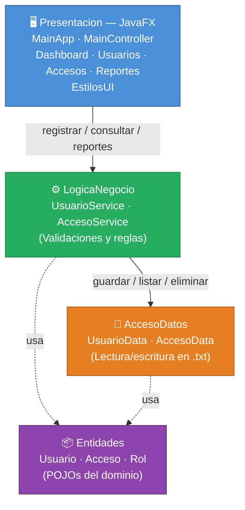

# Sistema de Control de Acceso a Laboratorio

Aplicación de escritorio desarrollada en **Java con interfaz gráfica JavaFX** y arquitectura por capas.  
Gestiona el registro de usuarios y controla su acceso a un laboratorio con persistencia en archivos `.txt`.

> Proyecto universitario — Programación 3 · Universidad Latina de Costa Rica

---

## Tabla de Contenidos

1. [Descripción General](#descripción-general)
2. [Funcionalidades](#funcionalidades)
3. [Tecnologías](#tecnologías)
4. [Requisitos del Sistema](#requisitos-del-sistema)
5. [Instalación y Ejecución](#instalación-y-ejecución)
6. [Arquitectura del Proyecto](#arquitectura-del-proyecto)
7. [Diagrama de Arquitectura](#diagrama-de-arquitectura)
8. [Estructura de Carpetas](#estructura-de-carpetas)
9. [Diseño de la Interfaz](#diseño-de-la-interfaz)
10. [Persistencia en Archivos .txt](#persistencia-en-archivos-txt)
11. [Validaciones Implementadas](#validaciones-implementadas)
12. [Autor](#autor)
13. [Notas](#notas)

---

## Descripción General

El sistema automatiza el control de acceso a un laboratorio académico mediante una interfaz visual moderna. Registra quién entra, quién sale y cuánto tiempo permanece cada usuario dentro de las instalaciones. Toda la información se almacena localmente en archivos de texto plano, sin base de datos.

Cuenta con **dos modos de ejecución**:
- **Interfaz gráfica (JavaFX)** — modo principal con dashboard, tablas, formularios y alertas visuales.
- **Modo consola** — alternativa ligera sin dependencias adicionales.

---

## Funcionalidades

### Gestión de Usuarios
- Registrar usuario (ID, nombre, rol: Estudiante o Docente)
- Consultar usuarios en tabla interactiva
- Eliminar usuario con confirmación visual
- Validar que no existan IDs duplicados

### Registro de Accesos
- Registrar entrada al laboratorio
- Registrar salida del laboratorio
- Bloquear doble entrada sin salida previa
- Bloquear salida sin entrada activa

### Dashboard
- Total de usuarios registrados
- Usuarios actualmente dentro del laboratorio
- Total acumulado de accesos registrados

### Reportes
- Historial de accesos por usuario con duración por visita
- Tiempo total acumulado dentro del laboratorio

---

## Tecnologías

| Tecnología | Versión | Uso |
|------------|---------|-----|
| Java | 17+ (probado en 24) | Lenguaje principal |
| JavaFX | 17+ (probado en 26) | Interfaz gráfica de escritorio |
| `BufferedReader/Writer` | — | Persistencia en archivos `.txt` |
| `java.time.LocalDateTime` | — | Registro de fecha y hora |
| `java.time.Duration` | — | Cálculo de tiempo en laboratorio |

---

## Requisitos del Sistema

- **Java JDK 17 o superior** — [Descargar aquí](https://adoptium.net/)
- **JavaFX SDK 17 o superior** — [Descargar aquí](https://gluonhq.com/products/javafx/) *(solo para la interfaz gráfica)*
- Sistema operativo: Windows, macOS o Linux
- Terminal o símbolo del sistema

> Si solo quieres usar el **modo consola**, no necesitas instalar JavaFX.

---

## Instalación y Ejecución

### Paso 1 — Clonar el repositorio

```bash
git clone https://github.com/chepe5251/examen2Progra3.git
cd examen2Progra3
```

---

### Paso 2 — Descargar JavaFX SDK *(solo para interfaz gráfica)*

1. Ve a [https://gluonhq.com/products/javafx/](https://gluonhq.com/products/javafx/)
2. Selecciona: versión **21 LTS** o superior · sistema operativo · tipo **SDK**
3. Descarga y extrae el zip en una carpeta fácil de recordar

```
Ejemplo Windows : C:\javafx-sdk-26\
Ejemplo macOS   : /Users/tu-usuario/javafx-sdk-26/
Ejemplo Linux   : /opt/javafx-sdk-26/
```

---

### Paso 3A — Ejecutar con interfaz gráfica (recomendado)

#### En Windows — doble clic en `run.bat`

O desde la terminal:

```bat
cd src

javac --module-path "C:\javafx-sdk-26\javafx-sdk-26\lib" ^
      --add-modules javafx.controls ^
      entidades/*.java ^
      accesodatos/*.java ^
      logicaNegocio/*.java ^
      presentacion/util/EstilosUI.java ^
      presentacion/controladores/*.java ^
      presentacion/MainApp.java

java --module-path "C:\javafx-sdk-26\javafx-sdk-26\lib" ^
     --add-modules javafx.controls ^
     --enable-native-access=javafx.graphics ^
     presentacion.MainApp
```

#### En macOS / Linux

```bash
cd src

javac --module-path "/ruta/javafx-sdk-26/lib" \
      --add-modules javafx.controls \
      entidades/*.java \
      accesodatos/*.java \
      logicaNegocio/*.java \
      presentacion/util/EstilosUI.java \
      presentacion/controladores/*.java \
      presentacion/MainApp.java

java --module-path "/ruta/javafx-sdk-26/lib" \
     --add-modules javafx.controls \
     --enable-native-access=javafx.graphics \
     presentacion.MainApp
```

> Reemplaza `/ruta/javafx-sdk-26/lib` con la ruta real donde extrajiste el SDK.

---

### Paso 3B — Ejecutar en modo consola *(sin JavaFX)*

#### En Windows — doble clic en `run-consola.bat`

O desde la terminal:

```bash
cd src
javac entidades/*.java accesodatos/*.java logicaNegocio/*.java presentacion/Main.java
java presentacion.Main
```

---

### Scripts incluidos (Windows)

| Archivo | Descripción |
|---------|-------------|
| `run.bat` | Abre la interfaz gráfica JavaFX directamente |
| `compilar.bat` | Recompila todo el proyecto |
| `run-consola.bat` | Ejecuta el modo consola sin JavaFX |

> Los scripts asumen que JavaFX está en `C:\javafx-sdk-26\javafx-sdk-26\`.  
> Si lo extrajiste en otra carpeta, edita la ruta dentro de cada `.bat`.

---

### Solución de problemas comunes

| Problema | Causa probable | Solución |
|----------|---------------|----------|
| `javafx.controls not found` | Ruta del SDK incorrecta | Verifica la ruta en `--module-path` |
| `Error: Main class not found` | No se compiló desde `src/` | Asegúrate de ejecutar los comandos dentro de `src/` |
| `ClassNotFoundException` | Falta compilar alguna capa | Ejecuta `compilar.bat` o el comando completo |
| `usuarios.txt` / `accesos.txt` vacíos | Primera ejecución | Normal, se crean al guardar el primer dato |

---

## Arquitectura del Proyecto

El proyecto sigue una **arquitectura estricta por capas**. Cada capa tiene una única responsabilidad y solo puede comunicarse con la capa inmediatamente inferior.

### Descripción de Capas

| Capa | Clase(s) | Responsabilidad |
|------|----------|----------------|
| `Entidades` | `Usuario`, `Acceso`, `Rol` | Modelos de datos puros (POJOs). Sin lógica de negocio. |
| `AccesoDatos` | `UsuarioData`, `AccesoData` | Lectura y escritura en archivos `.txt`. Sin validaciones. |
| `LogicaNegocio` | `UsuarioService`, `AccesoService` | Validaciones y reglas del dominio. Coordina acceso a datos. |
| `Presentacion` | `MainApp`, controladores, `EstilosUI` | Interfaz JavaFX. Solo usa `LogicaNegocio`. |

> La capa `Presentacion` **no puede acceder directamente** a `AccesoDatos`.  
> Toda comunicación pasa obligatoriamente por `LogicaNegocio`.

---

## Diagrama de Arquitectura



> `-->` dependencia directa entre capas &nbsp;·&nbsp; `-.->` uso de clases del dominio

---

## Estructura de Carpetas

```
examen2Progra3/
├── src/
│   ├── entidades/
│   │   ├── Rol.java                      ← Enum: ESTUDIANTE, DOCENTE
│   │   ├── Usuario.java                  ← POJO: id, nombre, rol
│   │   └── Acceso.java                   ← POJO: idUsuario, entrada, salida
│   ├── accesodatos/
│   │   ├── UsuarioData.java              ← Lectura/escritura usuarios.txt
│   │   └── AccesoData.java               ← Lectura/escritura accesos.txt
│   ├── logicaNegocio/
│   │   ├── UsuarioService.java           ← Validaciones de usuario
│   │   └── AccesoService.java            ← Validaciones de acceso + métricas
│   └── presentacion/
│       ├── MainApp.java                  ← Punto de entrada JavaFX
│       ├── Main.java                     ← Punto de entrada consola
│       ├── util/
│       │   └── EstilosUI.java            ← Paleta de colores y estilos CSS
│       └── controladores/
│           ├── MainController.java       ← Ventana principal + sidebar
│           ├── DashboardController.java  ← Panel de métricas
│           ├── UsuariosController.java   ← CRUD de usuarios
│           ├── AccesosController.java    ← Registro de entrada y salida
│           └── ReportesController.java   ← Historial y tiempo total
├── run.bat                               ← Ejecutar interfaz gráfica (Windows)
├── run-consola.bat                       ← Ejecutar modo consola (Windows)
├── compilar.bat                          ← Recompilar el proyecto (Windows)
├── .gitignore
├── usuarios.txt                          ← Generado automáticamente
├── accesos.txt                           ← Generado automáticamente
├── IA_USO.md
├── CHANGELOG.md
└── README.md
```

---

## Diseño de la Interfaz

| Elemento | Descripción |
|----------|-------------|
| Sidebar | Fondo `#0f2744` (azul oscuro) con navegación lateral |
| Tarjetas | Fondo blanco con sombra suave y bordes redondeados (`radius: 12`) |
| Badges de rol | Azul = Docente · Verde = Estudiante |
| Badges de estado | Verde = Activo · Gris = Completado |
| Alertas | Diálogos blancos para errores y confirmaciones |
| Tablas | `TableView` con columnas redimensionables y botón de acción por fila |

**Paleta de colores:**

| Color | Código | Uso |
|-------|--------|-----|
| Azul oscuro | `#0f2744` | Sidebar de navegación |
| Azul primario | `#3b82f6` | Botones, ítem activo |
| Verde | `#10b981` | Éxito, entrada, usuarios activos |
| Rojo | `#ef4444` | Errores, eliminación |
| Ámbar | `#f59e0b` | Advertencias, métricas |
| Gris claro | `#f1f5f9` | Fondo general |

---

## Persistencia en Archivos `.txt`

El sistema no utiliza base de datos. Los archivos se crean automáticamente en el directorio `src/` al guardar el primer dato.

### `usuarios.txt`
```
ID,Nombre,Rol
U001,Ana Torres,DOCENTE
U002,Luis Mora,ESTUDIANTE
```

### `accesos.txt`
```
idUsuario,fechaHoraEntrada,fechaHoraSalida
U001,2026-04-07T08:30:00,2026-04-07T10:15:00
U002,2026-04-07T09:00:00,null
```

> `null` en `fechaHoraSalida` indica que el usuario aún está dentro del laboratorio.

---

## Validaciones Implementadas

### Usuarios
- ID, nombre y rol no pueden estar vacíos ni ser nulos
- No se permiten IDs duplicados

### Accesos
- **Doble entrada bloqueada** — no se registra entrada si ya hay una activa
- **Salida sin entrada bloqueada** — no se registra salida sin entrada previa activa
- El usuario debe existir antes de registrar cualquier acceso
- El tiempo total solo considera accesos con salida registrada

---

## Autor

| Campo | Valor |
|-------|-------|
| **Nombre** | Alejandro Rodriguez Sanabria |
| **Carné** | 202401110564 |
| **Curso** | Programación 3 |
| **Universidad** | Universidad Latina de Costa Rica |

---

## Notas

- Los archivos `usuarios.txt` y `accesos.txt` se generan en el directorio `src/` al ejecutar por primera vez.
- Para reiniciar los datos, elimina o vacía esos dos archivos.
- `Main.java` (consola) se conserva como alternativa sin dependencias externas.
- Los scripts `.bat` están configurados para Windows con JavaFX en `C:\javafx-sdk-26\javafx-sdk-26\`. Si extrajiste el SDK en otra ruta, edita esa línea en cada archivo `.bat`.
- Se incluyen `IA_USO.md` y `CHANGELOG.md` como parte de la documentación del proyecto.
