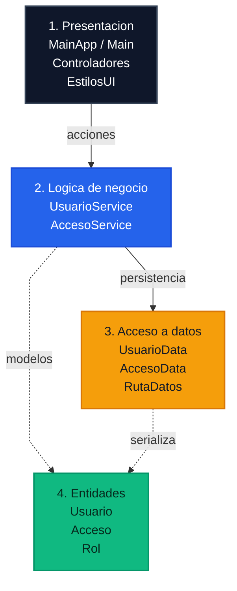

# Sistema de Control de Acceso a Laboratorio

Aplicación de escritorio desarrollada en Java con interfaz JavaFX y arquitectura por capas.
Permite registrar usuarios, controlar entradas y salidas del laboratorio, consultar métricas y revisar reportes históricos con persistencia en archivos `.txt`.

> Proyecto universitario de Programación 3 - Universidad Latina de Costa Rica

---

## Contenido

1. [Descripción general](#descripción-general)
2. [Mejoras incorporadas](#mejoras-incorporadas)
3. [Funcionalidades](#funcionalidades)
4. [Tecnologías](#tecnologías)
5. [Requisitos](#requisitos)
6. [Ejecución](#ejecución)
7. [Arquitectura](#arquitectura)
8. [Estructura del proyecto](#estructura-del-proyecto)
9. [Persistencia en archivos](#persistencia-en-archivos)
10. [Validaciones implementadas](#validaciones-implementadas)
11. [Autor](#autor)
12. [Notas](#notas)

---

## Descripción general

El sistema automatiza el control de acceso a un laboratorio académico mediante dos modos de uso:

- Interfaz gráfica JavaFX: modo principal con dashboard, navegación lateral, formularios, tablas y alertas visuales.
- Modo consola: alternativa ligera para ejecutar el sistema sin dependencias de JavaFX.

Toda la información se almacena localmente en archivos de texto plano. No utiliza base de datos.

---

## Mejoras incorporadas

Versión actual del proyecto:

- Dashboard con métricas de usuarios, accesos acumulados y personas actualmente dentro del laboratorio.
- Sidebar de navegación entre Dashboard, Usuarios, Accesos y Reportes.
- Barra superior con fecha y hora en vivo.
- Formularios visuales para registrar usuarios y movimientos de acceso.
- Tablas con badges de estado y rol para mejorar legibilidad.
- Reportes con historial por usuario y tiempo total acumulado.
- Persistencia estable en archivos `.txt` dentro de `src`, sin depender del directorio desde el que se ejecute la aplicación.
- Scripts de Windows para compilar y ejecutar tanto la interfaz gráfica como el modo consola.

---

## Funcionalidades

### Gestión de usuarios
- Registrar usuarios con ID, nombre y rol.
- Listar usuarios registrados.
- Eliminar usuarios desde la interfaz gráfica o el modo consola.
- Bloquear IDs duplicados.
- Bloquear eliminación de usuarios con una entrada activa.

### Registro de accesos
- Registrar entrada al laboratorio.
- Registrar salida del laboratorio.
- Evitar doble entrada sin salida previa.
- Evitar salida sin una entrada activa.

### Dashboard
- Total de usuarios registrados.
- Total de accesos registrados.
- Cantidad de personas dentro del laboratorio.

### Reportes
- Historial de accesos por usuario.
- Duración por visita.
- Tiempo total acumulado dentro del laboratorio.
- Consulta por ID incluso si el usuario ya no está en la lista activa.

---

## Tecnologías

| Tecnología | Versión | Uso |
|------------|---------|-----|
| Java | 17 o superior | Lenguaje principal |
| JavaFX | 17 o superior | Interfaz gráfica |
| `BufferedReader` / `BufferedWriter` | Incluido en Java | Persistencia en texto plano |
| `java.time.LocalDateTime` | Incluido en Java | Registro de fecha y hora |
| `java.time.Duration` | Incluido en Java | Cálculo de tiempo en laboratorio |

---

## Requisitos

- JDK 17 o superior.
- JavaFX SDK 17 o superior para ejecutar la interfaz gráfica.
- Sistema operativo Windows, macOS o Linux.

> Si solo vas a usar el modo consola, JavaFX no es necesario.

---

## Ejecución

### 1. Clonar el repositorio

```bash
git clone https://github.com/chepe5251/examen2Progra3.git
cd examen2Progra3
```

### 2. Descargar JavaFX SDK

Descarga el SDK desde <https://gluonhq.com/products/javafx/> y extráelo en una ruta conocida.

Ejemplos:

```text
Windows: C:\javafx-sdk-26\javafx-sdk-26\
macOS  : /Users/tu-usuario/javafx-sdk-26/
Linux  : /opt/javafx-sdk-26/
```

### 3A. Ejecutar la interfaz gráfica

#### Windows

El proyecto incluye estos scripts:

- `compilar.bat`
- `run.bat`
- `Iniciar.vbs`

Uso recomendado:

```bat
compilar.bat
run.bat
```

`Iniciar.vbs` compila en segundo plano y abre la aplicación con `javaw`, sin consola visible.

También puedes ejecutar manualmente:

```bat
cd src

javac --module-path "C:\javafx-sdk-26\javafx-sdk-26\lib" ^
      --add-modules javafx.controls ^
      entidades\*.java ^
      accesodatos\*.java ^
      logicaNegocio\*.java ^
      presentacion\util\EstilosUI.java ^
      presentacion\controladores\*.java ^
      presentacion\Main.java ^
      presentacion\MainApp.java

java --module-path "C:\javafx-sdk-26\javafx-sdk-26\lib" ^
     --add-modules javafx.controls ^
     --enable-native-access=javafx.graphics ^
     presentacion.MainApp
```

#### macOS / Linux

```bash
cd src

javac --module-path "/ruta/javafx-sdk/lib" \
      --add-modules javafx.controls \
      entidades/*.java \
      accesodatos/*.java \
      logicaNegocio/*.java \
      presentacion/util/EstilosUI.java \
      presentacion/controladores/*.java \
      presentacion/Main.java \
      presentacion/MainApp.java

java --module-path "/ruta/javafx-sdk/lib" \
     --add-modules javafx.controls \
     --enable-native-access=javafx.graphics \
     presentacion.MainApp
```

### 3B. Ejecutar el modo consola

#### Windows

Script incluido:

- `run-consola.bat`

O manualmente:

```bat
cd src
javac entidades\*.java accesodatos\*.java logicaNegocio\*.java presentacion\Main.java
java presentacion.Main
```

#### macOS / Linux

```bash
cd src
javac entidades/*.java accesodatos/*.java logicaNegocio/*.java presentacion/Main.java
java presentacion.Main
```

### Scripts incluidos actualmente

| Archivo | Descripción |
|---------|-------------|
| `compilar.bat` | Compila todo el proyecto con JavaFX en Windows |
| `run.bat` | Ejecuta la interfaz gráfica en Windows |
| `run-consola.bat` | Compila y ejecuta el modo consola en Windows |
| `Iniciar.vbs` | Lanza la interfaz gráfica sin mostrar consola |

### Problemas comunes

| Problema | Causa probable | Solución |
|----------|---------------|----------|
| `javafx.controls not found` | Ruta del SDK incorrecta | Revisa `JAVAFX_LIB` en los scripts o el `--module-path` manual |
| `ClassNotFoundException` | Faltan clases por compilar | Ejecuta `compilar.bat` o compila manualmente desde `src` |
| No se crean `usuarios.txt` o `accesos.txt` | No se completó la compilación / ejecución | Usa los scripts incluidos o ejecuta desde la raíz del proyecto |
| Error al eliminar un usuario | El usuario tiene una entrada activa | Registra primero la salida y luego intenta eliminarlo |

---

## Arquitectura

El proyecto sigue una arquitectura por capas.

| Capa | Clases principales | Responsabilidad |
|------|--------------------|-----------------|
| `entidades` | `Usuario`, `Acceso`, `Rol` | Modelos del dominio |
| `accesodatos` | `UsuarioData`, `AccesoData`, `RutaDatos` | Lectura y escritura en `.txt` |
| `logicaNegocio` | `UsuarioService`, `AccesoService` | Validaciones y reglas del sistema |
| `presentacion` | `MainApp`, `Main`, controladores, `EstilosUI` | UI JavaFX y modo consola |

### Diagrama visual



Lectura rápida del diagrama:

- Flujo principal: `Presentacion -> Logica de negocio -> Acceso a datos`.
- `Entidades` representa el modelo del sistema y lo usan tanto `logicaNegocio` como `accesodatos`.
- Flechas continuas: dependencia directa entre capas.
- Flechas punteadas: uso de modelos del dominio.

Flujo principal:

- `presentacion` usa `logicaNegocio`.
- `logicaNegocio` coordina `accesodatos`.
- `accesodatos` serializa y recupera entidades.

---

## Estructura del proyecto

```text
examen2Progra3/
|-- src/
|   |-- accesodatos/
|   |   |-- AccesoData.java
|   |   |-- RutaDatos.java
|   |   `-- UsuarioData.java
|   |-- entidades/
|   |   |-- Acceso.java
|   |   |-- Rol.java
|   |   `-- Usuario.java
|   |-- logicaNegocio/
|   |   |-- AccesoService.java
|   |   `-- UsuarioService.java
|   `-- presentacion/
|       |-- Main.java
|       |-- MainApp.java
|       |-- controladores/
|       |   |-- AccesosController.java
|       |   |-- DashboardController.java
|       |   |-- MainController.java
|       |   |-- ReportesController.java
|       |   `-- UsuariosController.java
|       `-- util/
|           `-- EstilosUI.java
|-- .gitignore
|-- CHANGELOG.md
|-- IA_USO.md
|-- Iniciar.vbs
|-- README.md
|-- compilar.bat
|-- run.bat
`-- run-consola.bat
```

---

## Persistencia en archivos

Los datos se guardan en:

- `src/usuarios.txt`
- `src/accesos.txt`

Formato esperado:

### `usuarios.txt`

```text
U001,Ana Torres,DOCENTE
U002,Luis Mora,ESTUDIANTE
```

### `accesos.txt`

```text
U001,2026-04-07T08:30:00,2026-04-07T10:15:00
U002,2026-04-07T09:00:00,null
```

`null` en la salida indica que el usuario aún está dentro del laboratorio.

Restricciones del formato:

- El ID no puede contener comas.
- El nombre no puede contener comas.
- Si un archivo tiene líneas mal formateadas, la lectura falla con un mensaje de error claro.

---

## Validaciones implementadas

### Usuarios
- ID obligatorio.
- Nombre obligatorio.
- Rol obligatorio.
- No se permiten IDs duplicados.
- No se permiten comas en ID ni nombre.
- No se permite eliminar un usuario si tiene una entrada activa.

### Accesos
- No se permite registrar entrada si ya existe una entrada activa.
- No se permite registrar salida sin entrada activa.
- El usuario debe existir antes de registrar una entrada o una salida.
- El tiempo total solo considera accesos con salida registrada.
- El historial se puede consultar por ID aunque el usuario ya no figure en la lista activa.

---

## Autor

| Campo | Valor |
|-------|-------|
| Nombre | Alejandro Rodriguez Sanabria |
| Carné | 202401110564 |
| Curso | Programación 3 |
| Universidad | Universidad Latina de Costa Rica |

---

## Notas

- El proyecto contiene archivos `.class` generados por compilaciones locales.
- La ruta de JavaFX por defecto en Windows está configurada como `C:\javafx-sdk-26\javafx-sdk-26\lib`.
- Si instalaste JavaFX en otra ubicación, ajusta `JAVAFX_LIB` en `compilar.bat` y `run.bat`.
- `Main.java` se mantiene como alternativa de consola.
- `IA_USO.md` y `CHANGELOG.md` forman parte de la documentación complementaria.
