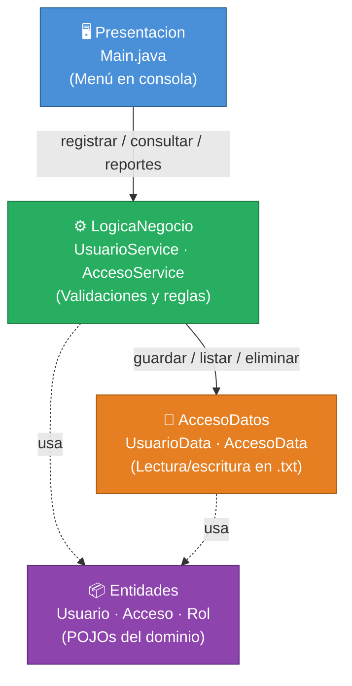

# Sistema de Control de Acceso a Laboratorio

Aplicación de consola desarrollada en Java con arquitectura por capas.  
Gestiona el registro de usuarios y controla su acceso a un laboratorio mediante archivos `.txt` como sistema de persistencia.

---

## Descripción General

El sistema automatiza el control de acceso a un laboratorio académico. Registra quién entra, quién sale y cuánto tiempo permanece cada usuario dentro de las instalaciones. Toda la información se almacena localmente en archivos de texto plano, sin necesidad de base de datos.

---

## Objetivo del Sistema

Desarrollar una aplicación de consola en Java que demuestre el uso correcto de la **arquitectura por capas**, aplicando principios de separación de responsabilidades, validación de reglas de negocio y persistencia de datos en archivos `.txt`.

---

## Funcionalidades Principales

### Gestión de Usuarios
- Registrar un nuevo usuario (ID, nombre, rol)
- Consultar la lista completa de usuarios registrados
- Eliminar un usuario por ID
- Validar que no existan IDs duplicados

### Registro de Accesos
- Registrar la entrada de un usuario al laboratorio
- Registrar la salida de un usuario del laboratorio
- Bloquear doble entrada sin salida previa registrada
- Bloquear salida si no existe una entrada activa

### Reportes
- Consultar el historial completo de accesos por usuario
- Calcular el tiempo total acumulado dentro del laboratorio

---

## Tecnologías Utilizadas

| Tecnología | Uso |
|------------|-----|
| Java (JDK 17+) | Lenguaje de programación principal |
| `BufferedReader` / `BufferedWriter` | Lectura y escritura en archivos `.txt` |
| `java.time.LocalDateTime` | Registro de fecha y hora de entrada y salida |
| `java.time.Duration` | Cálculo del tiempo dentro del laboratorio |
| `Scanner` | Lectura de entrada del usuario en consola |

---

## Arquitectura del Proyecto

El proyecto sigue una **arquitectura estricta por capas**. Cada capa tiene una única responsabilidad y solo puede comunicarse con la capa inmediatamente inferior.

### Descripción de Capas

| Capa | Clase(s) | Responsabilidad |
|------|----------|----------------|
| `Entidades` | `Usuario`, `Acceso`, `Rol` | Modelos de datos puros (POJOs). Sin lógica de negocio. |
| `AccesoDatos` | `UsuarioData`, `AccesoData` | Lectura y escritura en archivos `.txt`. Sin validaciones. |
| `LogicaNegocio` | `UsuarioService`, `AccesoService` | Validaciones y reglas del dominio. Coordina el acceso a datos. |
| `Presentacion` | `Main` | Menú interactivo en consola. Solo usa `LogicaNegocio`. |

> La capa `Presentacion` **no puede acceder directamente** a `AccesoDatos`.  
> Toda comunicación pasa obligatoriamente por `LogicaNegocio`.

---

## Diagrama de Arquitectura



> `-->` dependencia directa entre capas &nbsp;·&nbsp; `-.->` uso de clases del dominio

---

## Estructura de Carpetas

```
examen2Progra3/
├── src/
│   ├── entidades/
│   │   ├── Rol.java
│   │   ├── Usuario.java
│   │   └── Acceso.java
│   ├── accesodatos/
│   │   ├── UsuarioData.java
│   │   └── AccesoData.java
│   ├── logicaNegocio/
│   │   ├── UsuarioService.java
│   │   └── AccesoService.java
│   └── presentacion/
│       └── Main.java
├── usuarios.txt
├── accesos.txt
├── IA_USO.md
├── CHANGELOG.md
└── README.md
```

---

## Persistencia en Archivos `.txt`

El sistema no utiliza base de datos. Toda la información se guarda en dos archivos de texto plano que se crean automáticamente en el directorio de ejecución al realizar la primera operación de escritura.

### `usuarios.txt`
Cada línea representa un usuario registrado con el siguiente formato:
```
ID,Nombre,Rol
```
Ejemplo:
```
U001,Ana Torres,DOCENTE
U002,Luis Mora,ESTUDIANTE
```

### `accesos.txt`
Cada línea representa un registro de acceso con el siguiente formato:
```
idUsuario,fechaHoraEntrada,fechaHoraSalida
```
El campo `fechaHoraSalida` contiene el valor `null` mientras el usuario permanece dentro del laboratorio.

Ejemplo:
```
U001,2026-04-07T08:30:00,2026-04-07T10:15:00
U002,2026-04-07T09:00:00,null
```

---

## Validaciones Implementadas

### Usuarios
- El ID, nombre y rol no pueden estar vacíos ni ser nulos
- No se permiten dos usuarios con el mismo ID

### Accesos
- No se puede registrar una entrada si el usuario ya tiene una activa (**doble entrada bloqueada**)
- No se puede registrar una salida si el usuario no tiene una entrada activa (**salida sin entrada bloqueada**)
- El usuario debe existir en el sistema antes de registrar cualquier acceso
- El cálculo de tiempo total únicamente considera registros con salida registrada

---

## Cómo Ejecutar el Proyecto

### Requisitos Previos
- **JDK 17** o superior instalado
- Terminal o símbolo del sistema

### Pasos

**1. Clonar el repositorio**
```bash
git clone https://github.com/chepe5251/examen2Progra3.git
cd examen2Progra3
```

**2. Compilar todas las clases**
```bash
cd src
javac entidades/*.java accesodatos/*.java logicaNegocio/*.java presentacion/*.java
```

**3. Ejecutar el programa**
```bash
java presentacion.Main
```

> Los archivos `usuarios.txt` y `accesos.txt` se generan automáticamente dentro del directorio `src/` al guardar datos por primera vez.

---

## Autor

| Campo | Valor |
|-------|-------|
| **Nombre** | Alejandro Rodriguez Sanabria |
| **Carné** | 202401110564 |
| **Curso** | Programación 3 |
| **Universidad** | Universidad Latina |

---

## Notas

- Los archivos `usuarios.txt` y `accesos.txt` deben estar en el mismo directorio desde donde se ejecuta el programa.
- El sistema fue desarrollado y probado con Java 17 en terminal de Windows.
- Para limpiar los datos de prueba, basta con vaciar o eliminar los archivos `usuarios.txt` y `accesos.txt`.
- Se incluye el archivo `IA_USO.md` con la documentación del uso de inteligencia artificial durante el desarrollo del proyecto.
