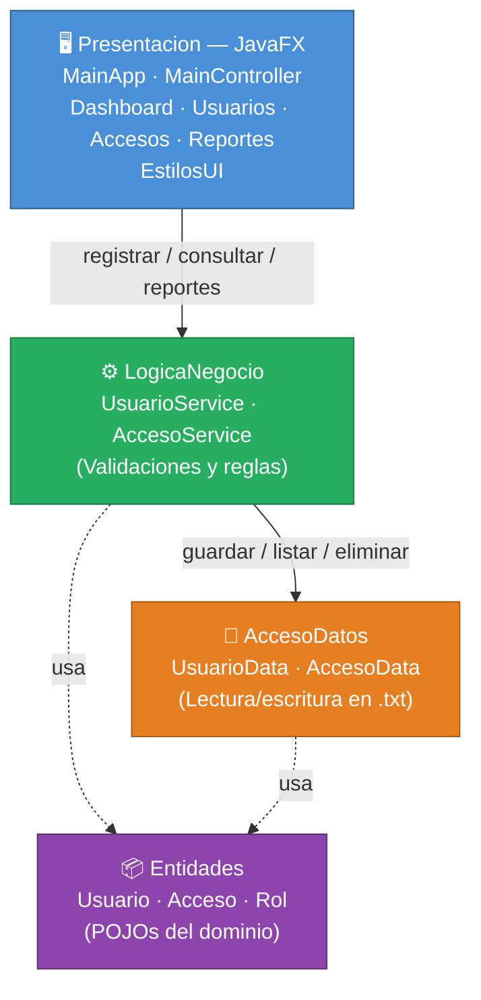

# Sistema de Control de Acceso a Laboratorio

Aplicación de escritorio desarrollada en Java con interfaz gráfica **JavaFX** y arquitectura por capas.  
Gestiona el registro de usuarios y controla su acceso a un laboratorio mediante archivos `.txt` como sistema de persistencia.

---

## Descripción General

El sistema automatiza el control de acceso a un laboratorio académico mediante una interfaz visual moderna. Registra quién entra, quién sale y cuánto tiempo permanece cada usuario dentro de las instalaciones. Toda la información se almacena localmente en archivos de texto plano, sin necesidad de base de datos.

El proyecto cuenta con dos modos de ejecución:
- **Interfaz gráfica (JavaFX)** — modo principal con dashboard, tablas, formularios y alertas visuales.
- **Modo consola** — alternativa ligera sin dependencias adicionales.

---

## Objetivo del Sistema

Desarrollar una aplicación de escritorio en Java que demuestre el uso correcto de la **arquitectura por capas**, aplicando principios de separación de responsabilidades, validación de reglas de negocio, persistencia de datos en archivos `.txt` e interfaz de usuario moderna con JavaFX.

---

## Funcionalidades Principales

### Gestión de Usuarios
- Registrar un nuevo usuario (ID, nombre, rol)
- Consultar la lista completa de usuarios en tabla interactiva
- Eliminar un usuario por ID con confirmación visual
- Validar que no existan IDs duplicados

### Registro de Accesos
- Registrar la entrada de un usuario al laboratorio
- Registrar la salida de un usuario del laboratorio
- Bloquear doble entrada sin salida previa registrada
- Bloquear salida si no existe una entrada activa

### Dashboard
- Mostrar total de usuarios registrados en tiempo real
- Mostrar cuántos usuarios están actualmente dentro del laboratorio
- Mostrar el total acumulado de accesos registrados

### Reportes
- Consultar historial completo de accesos por usuario en tabla
- Calcular tiempo total acumulado dentro del laboratorio
- Ver duración individual de cada visita

---

## Tecnologías Utilizadas

| Tecnología | Uso |
|------------|-----|
| Java (JDK 17+) | Lenguaje de programación principal |
| JavaFX | Interfaz gráfica de escritorio |
| `BufferedReader` / `BufferedWriter` | Lectura y escritura en archivos `.txt` |
| `java.time.LocalDateTime` | Registro de fecha y hora de entrada y salida |
| `java.time.Duration` | Cálculo del tiempo dentro del laboratorio |
| `java.time.format.DateTimeFormatter` | Formateo de fechas en la interfaz |
| `Scanner` | Modo de ejecución alternativo por consola |

---

## Arquitectura del Proyecto

El proyecto sigue una **arquitectura estricta por capas**. Cada capa tiene una única responsabilidad y solo puede comunicarse con la capa inmediatamente inferior.

### Descripción de Capas

| Capa | Clase(s) | Responsabilidad |
|------|----------|----------------|
| `Entidades` | `Usuario`, `Acceso`, `Rol` | Modelos de datos puros (POJOs). Sin lógica de negocio. |
| `AccesoDatos` | `UsuarioData`, `AccesoData` | Lectura y escritura en archivos `.txt`. Sin validaciones. |
| `LogicaNegocio` | `UsuarioService`, `AccesoService` | Validaciones y reglas del dominio. Coordina el acceso a datos. |
| `Presentacion` | `MainApp`, `MainController`, `DashboardController`, `UsuariosController`, `AccesosController`, `ReportesController`, `EstilosUI` | Interfaz gráfica JavaFX. Solo usa `LogicaNegocio`. |

> La capa `Presentacion` **no puede acceder directamente** a `AccesoDatos`.  
> Toda comunicación pasa obligatoriamente por `LogicaNegocio`.

---

## Diagrama de Arquitectura



> `-->` dependencia directa entre capas &nbsp;·&nbsp; `-.->` uso de clases del dominio

---

## Diseño Visual de la Interfaz

| Elemento | Descripción |
|----------|-------------|
| Sidebar | Fondo `#0f2744` (azul oscuro) con navegación por secciones |
| Tarjetas | Fondo blanco con sombra suave y bordes redondeados |
| Badges | Verde = Estudiante / Activo · Azul = Docente · Gris = Completado |
| Alertas | Diálogos con fondo blanco para errores y confirmaciones |
| Tablas | `TableView` con columnas redimensionables y celda de acción |
| Paleta | Azul `#3b82f6` · Verde `#10b981` · Rojo `#ef4444` · Ámbar `#f59e0b` |

---

## Estructura de Carpetas

```
examen2Progra3/
├── src/
│   ├── entidades/
│   │   ├── Rol.java
│   │   ├── Usuario.java
│   │   └── Acceso.java
│   ├── accesodatos/
│   │   ├── UsuarioData.java
│   │   └── AccesoData.java
│   ├── logicaNegocio/
│   │   ├── UsuarioService.java
│   │   └── AccesoService.java
│   └── presentacion/
│       ├── MainApp.java                  ← Punto de entrada JavaFX
│       ├── Main.java                     ← Modo consola (alternativo)
│       ├── util/
│       │   └── EstilosUI.java            ← Paleta, estilos CSS y alertas
│       └── controladores/
│           ├── MainController.java       ← Ventana principal + sidebar
│           ├── DashboardController.java  ← Panel de métricas
│           ├── UsuariosController.java   ← CRUD de usuarios
│           ├── AccesosController.java    ← Entrada y salida
│           └── ReportesController.java  ← Historial y tiempo total
├── usuarios.txt
├── accesos.txt
├── IA_USO.md
├── CHANGELOG.md
└── README.md
```

---

## Persistencia en Archivos `.txt`

El sistema no utiliza base de datos. Toda la información se guarda en dos archivos de texto plano que se crean automáticamente en el directorio de ejecución al realizar la primera operación de escritura.

### `usuarios.txt`
Cada línea representa un usuario registrado con el siguiente formato:
```
ID,Nombre,Rol
```
Ejemplo:
```
U001,Ana Torres,DOCENTE
U002,Luis Mora,ESTUDIANTE
```

### `accesos.txt`
Cada línea representa un registro de acceso con el siguiente formato:
```
idUsuario,fechaHoraEntrada,fechaHoraSalida
```
El campo `fechaHoraSalida` contiene el valor `null` mientras el usuario permanece dentro del laboratorio.

Ejemplo:
```
U001,2026-04-07T08:30:00,2026-04-07T10:15:00
U002,2026-04-07T09:00:00,null
```

---

## Validaciones Implementadas

### Usuarios
- El ID, nombre y rol no pueden estar vacíos ni ser nulos
- No se permiten dos usuarios con el mismo ID

### Accesos
- No se puede registrar una entrada si el usuario ya tiene una activa (**doble entrada bloqueada**)
- No se puede registrar una salida si el usuario no tiene una entrada activa (**salida sin entrada bloqueada**)
- El usuario debe existir en el sistema antes de registrar cualquier acceso
- El cálculo de tiempo total únicamente considera registros con salida registrada

---

## Cómo Ejecutar el Proyecto

### Requisitos Previos
- **JDK 17** o superior instalado
- **JavaFX SDK 17+** — descargable desde [openjfx.io](https://openjfx.io)
- Terminal o símbolo del sistema

### Clonar el repositorio

```bash
git clone https://github.com/chepe5251/examen2Progra3.git
cd examen2Progra3/src
```

---

### Modo 1 — Interfaz Gráfica JavaFX (recomendado)

**Compilar:**
```bash
javac --module-path /ruta/javafx/lib --add-modules javafx.controls \
  entidades/*.java \
  accesodatos/*.java \
  logicaNegocio/*.java \
  presentacion/util/*.java \
  presentacion/controladores/*.java \
  presentacion/MainApp.java
```

**Ejecutar:**
```bash
java --module-path /ruta/javafx/lib --add-modules javafx.controls \
  presentacion.MainApp
```

> Reemplaza `/ruta/javafx/lib` con la ruta real donde descargaste el SDK de JavaFX.  
> Ejemplo Windows: `C:\javafx-sdk-21\lib`

---

### Modo 2 — Consola (sin JavaFX)

**Compilar:**
```bash
javac entidades/*.java accesodatos/*.java logicaNegocio/*.java presentacion/Main.java
```

**Ejecutar:**
```bash
java presentacion.Main
```

---

> Los archivos `usuarios.txt` y `accesos.txt` se generan automáticamente dentro del directorio `src/` al guardar datos por primera vez.

---

## Autor

| Campo | Valor |
|-------|-------|
| **Nombre** | Alejandro Rodriguez Sanabria |
| **Carné** | 202401110564 |
| **Curso** | Programación 3 |
| **Universidad** | Universidad Latina |

---

## Notas

- Los archivos `usuarios.txt` y `accesos.txt` deben estar en el mismo directorio desde donde se ejecuta el programa.
- El sistema fue desarrollado y probado con Java 17 en Windows.
- Para limpiar los datos de prueba, basta con vaciar o eliminar los archivos `usuarios.txt` y `accesos.txt`.
- `Main.java` (consola) se conserva como alternativa sin dependencias externas.
- Se incluye el archivo `IA_USO.md` con la documentación del uso de inteligencia artificial durante el desarrollo.
- Se incluye el archivo `CHANGELOG.md` con el historial de versiones del proyecto.
